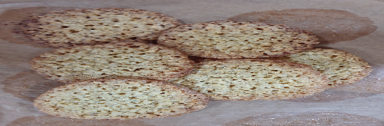

- [ ] 2dl kaurahiutaleita  
- [ ] 1 dl sokeria  
- [ ] ½ tl vaniljasokeria  
- [ ] 1 rkl vehnäjauhoja  
- [ ] 1 tl leivinjauhetta  
- [ ] 50g voita  
- [ ] 1 munaa

1. Yhdistä kuivat aineet kulhossa  
2. Lisää sulatettu, jäähdytetty voi  
3. Sekoita joukkoon muna  
4. Laita taikina 2 teelusikan kokoisina nokareina leivinpaperille. Jätä kaurakeksien ympärille tilaa, sillä ne leviävät paistettaessa.  
5. Paista kauralastut 200°C n. 7 minuuttia