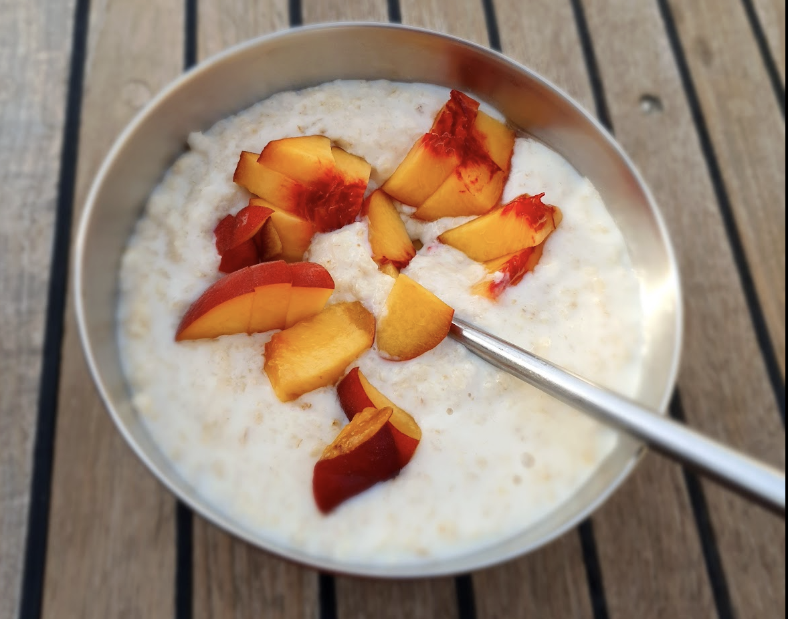

 

- [ ] 5 dl vettä  
- [ ] 2 dl kaurahiutaleita  
- [ ] ½ tl suolaa

1. Lisää suola ja kaurahiutaleet veteen, sekoita
2. Kiehauta puuro
3. Anna seistä kannen alla 10 minuuttia
4. Tarjoile hillon kera