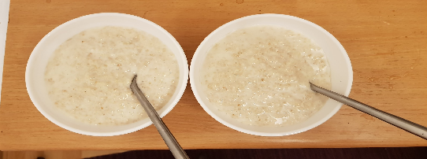

 

- [ ] 5 dl vettä  
- [ ] 2 dl kaurahiutaleita  
- [ ] 2 dl maitoa  
- [ ] ½ tl suolaa

1. Kiehauta vesi ja lisää suola ja kaurahiutaleet  
2. Kiehuta seosta 15 sekuntia  
3. Siirrä levyltä sivuun ja anna seistä kannen alla 10 minuuttia  
4. Laita levy keskilämmölle ja siirrä kattila takaisin hellalle. Lisää maito ja anna puuron kiehua hiljalleen kunnes se on halutun paksuista  
5. Mitä vähemmän puuroa sekoittaa, sen kuohkeampaa siitä tulee. Jatkuva sekoittaminen tuottaa liisterimäistä puuroa