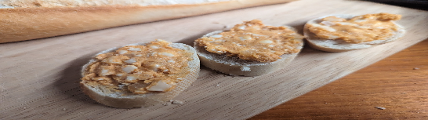

- [ ] 125g camembert juustoa  
- [ ] 1 sipuli  
- [ ] 1 ml kuminaa  
- [ ] 31g voita  
- [ ] 62g raejuustoa  
- [ ] 2ml suolaa  
- [ ] 2ml mustapippuria  
- [ ] 1 tl paprikajauhetta (makea)

1. Nosta voi pehmenemään  
2. Pilko camembert pieniksi kuutioiksi  
3. Pilko sipuli pieniksi kuutioiksi  
4. Sekoita voi, camembert ja raejuusto haarukalla sekaisin. Seokseen saa jäädä pieniä sattumia  
5. Lisää sipuli ja mausteet ja sekoita  
6. Anna obazdan maustua jääkaapissa vähintään 3-4 tuntia jotta sipulin maku pääsee leviämään kaikkialle