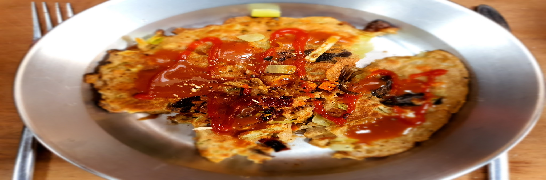

Okonomiyaki:  
- [ ] 4dl sienien liotusvettä  
- [ ] 4dl vehnäjauhoja  
- [ ] 2 porkkanaa (raastettua)
- [ ] 5dl kaalia (raastettua)
- [ ] 5 kananmunaa  
- [ ] 1 sipuli  
- [ ] 1dl aurinkokuivattuja tomaatteja  
- [ ] Sesamöljyä

Okonomiyaki-kastike:  
- [ ] 15ml ketsuppia  
- [ ] 15ml srirachaa  
- [ ] 15ml kalakastiketta  
- [ ] 5ml soijakastiketta  
- [ ] 5ml sokeria  
- [ ] 15ml maissitärkkelystä

1. Sekoita aineet hyvin ja anna seistä 15min  
2. Lämmitä sesamöljyä pannulla  
3. Kaada pannulle paksu lettu taikinaa  
4. Paista ensimmäistä puolta 5min  
5. Lisää päälliset (esim. sienet, kuivattu tomaatti) ja käännä lettu  
6. Paista toista puolta 5min ja käännä lettu  
7. Paista 5min  
8. Tarjoile okonomiyaki-kastikkeen ja majoneesin kera