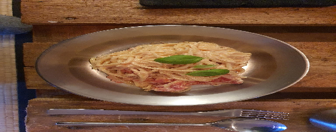

- [ ] 250 g spagettia  
- [ ] 200 g fetajuusto  
- [ ] 2 rkl oliiviöljyä  
- [ ] 400g kokonaisia tölkkitomaatteja  
- [ ] ½ tl mustapippuria  
- [ ] ¼ tl suolaa  
- [ ] ½ tl sokeria  
- [ ] ½ tl chilihiutaleita

1. Voitele vuoka lorauksella oliiviöljyä  
2. Laita feta kokonaisena vuokaan ja ripottele chilihiutaleet fetalle  
3. Lusikoi tölkkitomaatit fetan ympärille, jätä tomaattimehu käyttämättä  
4. Ripottele sokeria tölkkitomaattien päälle  
5. Rouhi mustapippuria ja ripottele suolaa kaiken päälle  
6. Paista uunissa noin 200 asteessa 20 minuuttia (Omnia 250°C 30min)  
7. Keitä pasta ohjeen mukaan  
8. Sekoita koko uunivuoallinen pastan joukkoon  
9. Tarjoile tuoreen basilikan kera