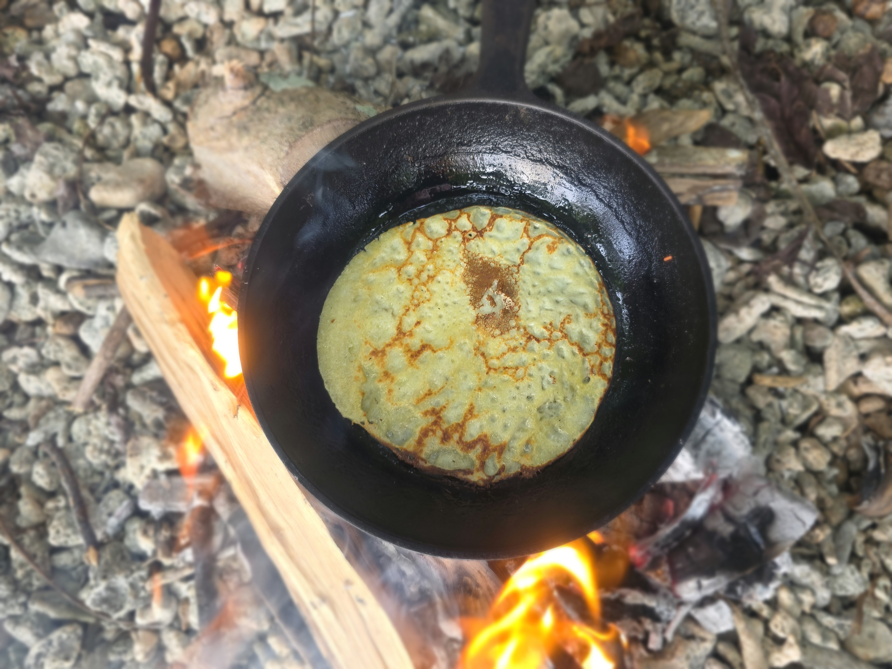

- [ ] 2 munaa  
- [ ] 1 dl maitojauhetta  
- [ ] 4 dl vettä  
- [ ] 2.5 dl vehnäjauhoja  
- [ ] 1 rkl sokeria  
- [ ] 1 tl suolaa
- [ ] hilloa

1. Vatkaa munien rakenne rikki kulhossa  
2. Lisää kylmä vesi  
3. Lisää maitojauhe ja sekoita lettutaikina tasaiseksi  
4. Lisää vehnäjauhot, sokeri ja suola ja sekoita taikina tasaiseksi  
5. Anna taikinan vetäytyä 30 min  
6. Paista pannulla voissa noin 1 dl/lettu määrällä taikinaa 9 lettua.