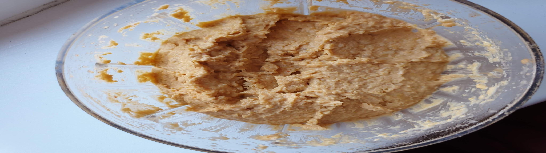

 

- [ ] 1 dl kuivattuja kikherneitä TAI  2 dl keitetettyjä  
- [ ] 2 rkl oliiviöljyä  
- [ ] 1 rkl vettä  
- [ ] 1/2 rkl sitruunamehua  
- [ ] 1/2 rkl balsamiviinietikkaa  
- [ ] 2 rkl paprikatahnaa  
- [ ] 3 kynttä valkosipulia  
- [ ] ½ tl suolaa  
- [ ] ½ tl kuminaa  
- [ ] ½ tl paprikajauhetta

1. Laita kikherneet likoamaan edellisenä iltana  
2. Keitä kikherneitä painekattilassa 20 minuuttia. Lisää ½ tl suolaa, ½ tl basilikaa ja 1 laakerinlehti.  
3. Kaada keitinvesi pois ja anna kikherneiden jäähtyä.  
4. Lisää ainekset tehosekoittimeen. Sekoita kunnes massa on tasaista. Jos hummus on liian jäykkää, voi sitä notkistaa lisäämällä oliiviöljyä tai vettä.