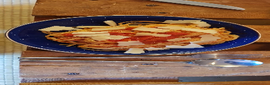

- [ ] 4 rkl oliiviöljyä  
- [ ] 5 kynttä valkosipulia  
- [ ] 1 tl persiljaa  
- [ ] 2 tl basilikaa  
- [ ] 400 g tomaattimurskaa  
- [ ] 2 annosta pastaa  
- [ ] 1 tl suolaa (pastaveteen)  
- [ ] 1 litra vettä  
- [ ] raastettua parmesania

1. Lisää suola keitinveteen ja aloita pastan keittäminen.  
2. Lämmitä pannulla keskilämmöllä 4 rkl oliiviöljyä.   
3. Murskaa valkosipuli veitsellä. Lisää pannulle valkosipuli ja paista kunnes valkosipuli ruskistuu hieman.  
4. Lisää persilja ja basilika pannulle.  
5. Lisää levyn lämpö korkeaksi ja lisää tomaattimurska. Laita pannun kansi hetkeksi päälle, sillä tomaatti räiskyy tässä kohden paljon.   
6. Keitä kastiketta kokoon ilman kantta kunnes voit puulastalla vetämällä jakaa kastikkeen kahteen osaan ilman että ne heti yhdistyvät. Lisää suolaa tarvittaessa.  
7. Kun pasta on valmis, siivilöi se ja sekoita pannulla olevan kastikkeen kanssa.  
8. Tarjoile raastetun parmesanin kanssa.

Tämä on perusta monelle erilaisella pastalle. Lisää erilaisia aineita ja kokeile mistä tulee juuri sinun lempipastasi\!