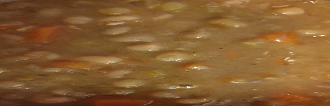

- [ ] 3 rkl rypsiöljyä  
- [ ] 1 sipuli  
- [ ] 2 porkkanaa (pilkottuna)
- [ ] 0.8 l kasvislientä  
- [ ] 250 g (3.5dl) kuivattuja herneitä (esiliotettuja)
- [ ] 1 tl curryjauhetta
- [ ] 1 tl garam masalaa  
- [ ] 1 tl mustapippuria  
- [ ] 1 tl suolaa
- [ ] Sinappia

1. Paista kattilassa keski lämmöllä sipulia ja porkkanoita kunnes sipulit ovat läpikuultavia   
2. Lisää mausteet kattilaan ja paista noin 30 sekunnin ajan.  
3. Lisää kasvisliemi ja esiliotetut herneet  
4. Painesta kattila ja vaihda levy miedolle lämmölle ja keitä soppaa 40 minuutin ajan  
5. 40 minuutin kuluttua, ota kattila liedeltä ja anna paineen laskeutua kattilassa kantta avaamatta.  
6. Sekoita keittoa, jotta herneet muussaantuvat hieman  
7. Tarjoile sinapin kera.