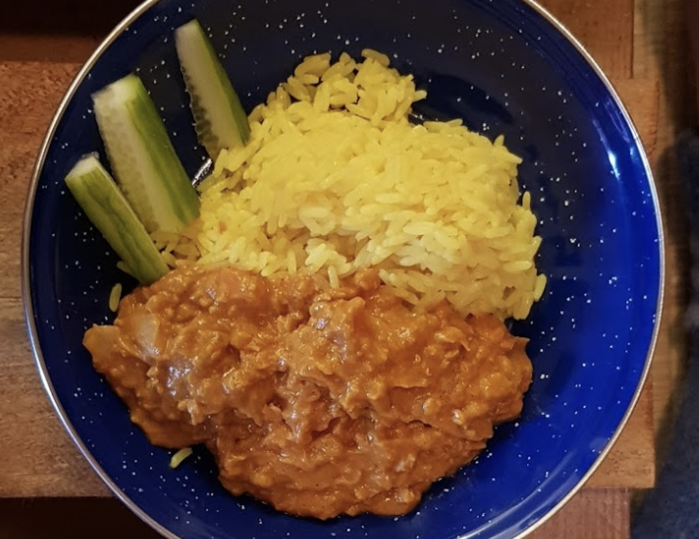

 

- [ ] 3 kynsi valkosipulia
- [ ] 1 sipuli
- [ ] 1 chili tai 1tl hiutaleita
- [ ] Rypsiöljyä
- [ ] 2dl punaisia linssejä
- [ ] ½dl maapähkinävoita
- [ ] 4rkl tomaattipyrettä
- [ ] 2rkl sitruunamehua
- [ ] 1tl jeeraa
- [ ] 1tl kanelia
- [ ] 1tl kurkumajauhetta
- [ ] 1 tl garam masalaa
- [ ] 1 tl inkiväärijauhetta

1. Sipuli, valkosipuli ja chili kuullottumaan pannulle öljyyn. Kun ovat läpikuultavia, lisää pannulle mausteet, ja pyörittele niitä noin minuutti, kunnes tuoksu nousee nenääsi pilvenä. Sitten sekaan linssit, pyörittele taas tovi, ja lisää kasvisliemi. Anna kiehahtaa 
2. Lisää sekaan maapähkinävoi ja tomaatit/tomaattipyree. Sekoittele ja anna hautua hiljalleen kiehuen noin 25 min välillä hämmennellen. Lisää vettä välillä, jos vaikuttaa menevän liian jänkiksi. Lisää sitruunamehua ja sekoita. Tarkista lopuksi maku ja lisää suolaa, jos on tarvis. 
3. Tarjoa riisin tai [naan](garlic-naan.md)-leivän kanssa. Koristele persiljalla ja jugurtilla, tai paahdetuilla manteliviipaleilla.
4. Kun tarkastat lopuksi makua: jos maku vaikuttaa liian "pyöreältä ja täyteläiseltä", voit huijata hieman ja lisätä töräyksen ketsuppia sekaan tasapainottamaan hapokkuutta ja makeutta. Anna soossin vain hautua hetken lisää ennen tarjoilua. En kerro kenellekään\!