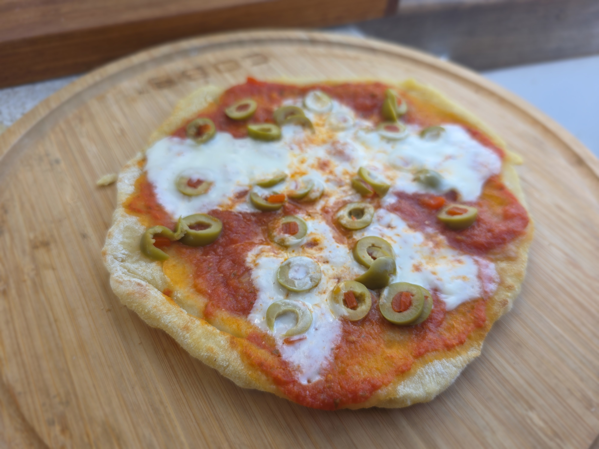

Taikina:  
- [ ] 3.5 dl vehnäjauhoja  
- [ ] 1 tl leivinjauhetta  
- [ ] 0.5 tl suolaa  
- [ ] 1.5 dl vettä  
- [ ] 3 rkl oliiviöljyä

Kastike:  
- [ ] 1 Sipuli  
- [ ] 4 kynttä valkosipulia  
- [ ] 70g tomaattipyrettä   
- [ ] 400g tomaattimurskaa   
- [ ] 1 tl oreganoa  
- [ ] 1 tl timjamia
- [ ] 1 tl basilikaa  
- [ ] laakerinlehti  
- [ ] 1 rkl soijakastiketta   
- [ ] ½ dl valkoviiniä

Kastike

1. Pilko sipuli  
2. Murskaa valkosipuli  
3. Kuumenna pannu ja laita sille 2 rkl oliiviöljyä ja paista sipuli läpikuultavaksi  
4. Lisää murskattu valkosipuli ja mausteet. Anna paistua 30 sekuntia.  
5. Lisää tomaattimurska  
6. Lisää tomaattipyree ja sekoita kastike huolella.  
7. Lisää soijakastike ja valkoviini  
8. Anna porista pannulla kunnes kastike on kiinteämpää. Mitä pidempään kastike porisee, sen parempaa siitä tulee.  
9. Blenderöi jäähtynyt kastike tasaiseksi seokseksi.

Taikina

1. Sekoita kaikki kuivat aineet keskenään.   
2. Lisää öljy ja vesi.  
3. Vaivaa taikina tasaiseksi  
4. Jaa taikina kahtia   
5. Kauli kaksi samankokoista pyöreää kiekkoa.

Pitsan paisto

1. Kuumenna pannu  
2. Lorauta pannulle oliiviöljyä   
3. Laita ensimmäinen pitsapohja pannulle ja paista sitä noin kolme miniuttia kunnes se hieman kuplii ja saa kauniin ruskean sävyn alapintaansa.   
4. Käännä pitsapohja  
5. Levitä päälle tomaattikastike (noin desi)  
6. Ripottele päälle juustoraastetta  
7. lisää oliivit  
8. peitä pannu kannella ja pienennä levyn kuumuutta.  
9. Paista pitsaa kannen alla noin 6 minuuttia kunnea juusto on sulanut eikä pohja ole vielä palanut.