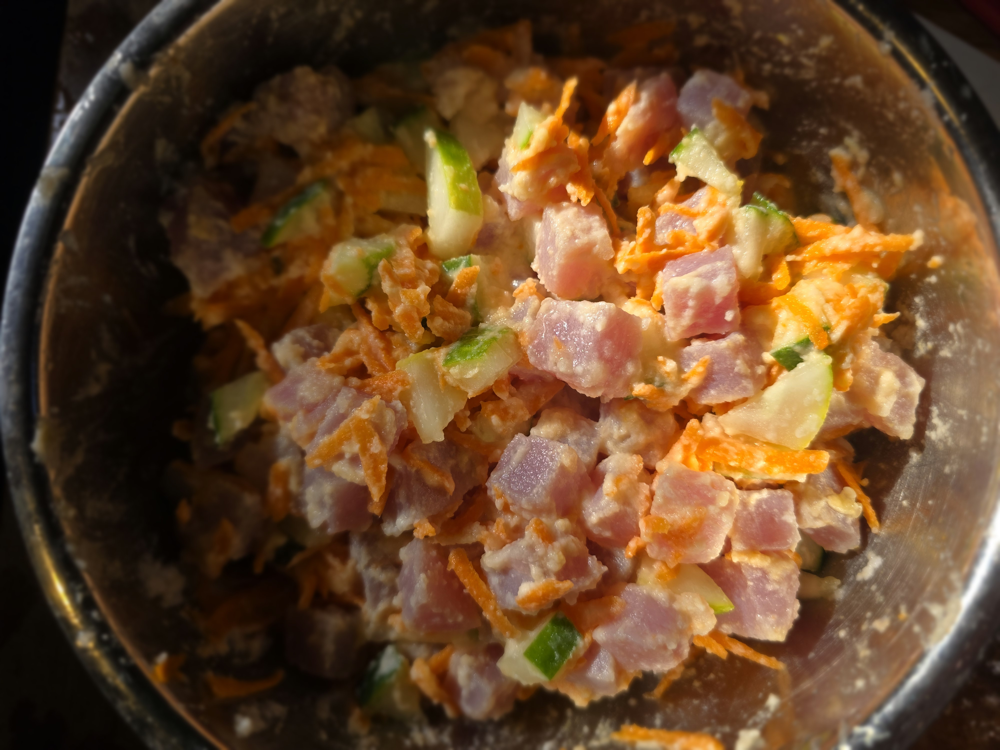

- [ ] 800g tonnikalaa
- [ ] 10 limettiä
- [ ] 5dl kookosmaitoa
- [ ] 2 porkkanaa
- [ ] 1 kurkku
- [ ] Suolaa
- [ ] Mustapippuria 

1. Paloittele tonnikala noin 1cm kuutioiksi
2. Purista limetit niin että tonnikala peittyy linettimehuun. Anna valmistua 10min
3. Raasta porkkanat ja pilko kurkku
4. Valuta limettimehu pois
5. Sekoita kookosmaito, kala, vihannekset ja mausteet
