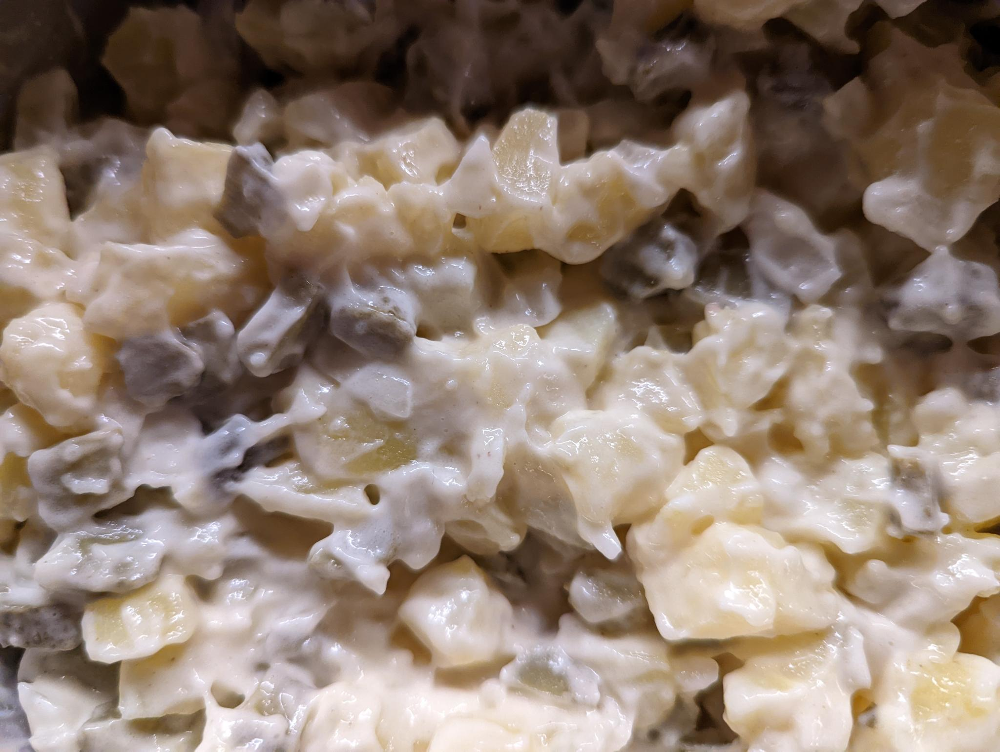

- [ ] 500 g perunaa  
- [ ] 1 sipuli
- [ ] 150g maustekurkkua

MAJONEESI:  
- [ ] 1 kananmunan keltuaista
- [ ] 2 ml suolaa  
- [ ] 1 ml valkopippuria  
- [ ] 1 tl dijon sinappia  
- [ ] ½ rkl valkoviinietikkaa  
- [ ] 2 ½  dl rypsiöljyä  
- [ ] 2 rkl vettä (käden lämpöistä)

ESIVALMISTELUT
1. Keitä perunat suolavedessä (1 tl suolaa / litra vettä)    
2. Painekeittimessä: Pane perunat painekeittimeen, jonka pohjalla on 1–1.5dl suolattua vettä. Sulje keitin. Kun paine on noussut, keitä 10 minuuttia. Avaa kansi, kun höyrypaine on laskenut.
3. Anna perunoiden jäähtyä

MAJONEESI  
1. Sekoita keltuainen, suola, valkopippuri sinappi ja valkoviinietikka keskenään.  
2. Vatkaa joukkoon öljy. Aloita öljyn lisääminen hyvin varovasti ja lisää loput öljystä vähän kerrallaan koko ajan vatkaten. Jos majoneesi on tymäkkää, notkistamiseen voi käyttää muutaman ruokalusikallisen lämmitettyä kädenlämpöistä vettä.  

SALAATTI  
1. Kuori ja kuutioi keitetyt jäähtyneet perunat 
2. Hienonna sipuli  
3. Kuutioi maustekurkku  
4. Lisää majoneesi  
5. Sekoita kaikki aineet yhteen  
6. Anna vetäytyä ja maustua vähintään 8 tuntia.