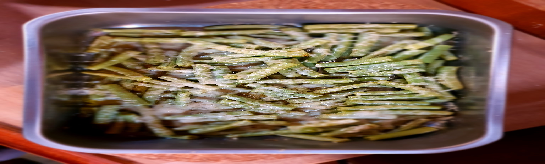

 

- [ ] 800g perunaa  
- [ ] 150 g pakastepinaattia  
- [ ] 3 dl juustoraastetta  
- [ ] 2-3 dl maitoa  
- [ ] 1tl basilikaa  
- [ ] Öljyä vuuan pohjalle

1. Levitä voideltuun vuokaan puolet perunaviipaleista ja niiden päälle esiliotettu pinaatti  
2. Ripottele pinaatin päälle 1 dl juustoraastetta ja basilika  
3. Lisää loput perunaviipaleet, maito ja juustoraaste  
4. Kypsennä vuokaa uunissa 170 asteessa kunnes perunat ovat kypsyneet, noin 50 minuuttia