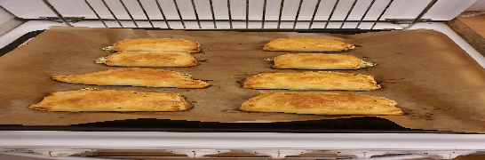

- [ ] 150g voita 
- [ ] 150g vehnäjauhoja  
- [ ] 1dl vettä (kylmää)

1. Nypi jauhot ja 50g voita tasaiseksi murumaiseksi seokseksi. Sekoita vesi nopeasti joukkoon. Muotoile taikina kelmun sisään levyksi ja nosta pakastimeen noin 10 minuutiksi.  
2. Kauli taikina noin 30 cm x 30 cm:n kokoiseksi levyksi.  
3. Viipaloi kylmä voi esimerkiksi juustohöylällä ja lado viipaleet vinottain taikinalevyn keskelle neliön muotoon. Taita taikinan nurkat rasvan päälle kirjekuoren tapaan.  
4. Ripottele taikinan kummallekin puolelle jauhoja ja kauli taikinalevyä ohuemmaksi. Kauli varovasti kulmia kohden, jotta rasva pysyy sisällä. Pyyhi ylimääräiset jauhot pois ja taita levy kolmeen osaan.  
5. Jauhota taikinalevy ja kauli ohuemmaksi. Taittele kolmeen osaan ja kaaviloi. Taita taikina vuorotellen eri suuntiin. Taita taikina vielä kolmeen osaan ja nosta kelmussa pakastimeen noin 15 minuutiksi.  
6. Kauli jäähtynyt taikina taas levyksi ja taita kolmeen osaan. Toista taittelu ja kauliminen vielä 2 kertaa. Paketoi taikina kelmuun ja anna levätä pakastimessa 15 minuuttia.