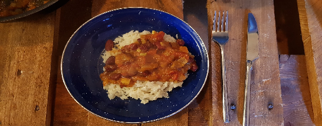

 

- [ ] 1.3 dl kuivattuja kidney-papuja keitettynä   
- [ ] 1 iso sipuli  
- [ ] 250g tölkkitomaattia  
- [ ] 4 kynttä valkosipulia  
- [ ] 2.5cm  inkivääriä  
- [ ] 1 tl korianterijauhetta  
- [ ] ½ tl chilijauhetta  
- [ ] ¼ tl kurkum jauhetta  
- [ ] ½ tl garam masala jauhetta  
- [ ] ½ tl kuminajauhetta  
- [ ] 3 rkl öljyä  
- [ ] 3 rkl kefiiiriä tai kermaa  
- [ ] 2 ml suolaa

1. Lämmitä öljy pannulla ja kuullota sipulit kultaisiksi  
2. Lisää chili, valkosipuli, inkivääri ja anna hautua  
3. Lisää tomaatit ja anna hautua 4-5 minuuttia  
4. Lisää kidney pavut ja 3.5 dl papujen keitinvettä  
5. Lisää suola ja anna kastikkeen keittyä hiljakseen kunnes se on hieman tihentynyt  
6. Kun kastikkeen koostumus on mieluisa, lisää kefiiri tai kerma, anna hautua minuutin ajan.   
7. Tarjoile riisin ja jugurtin kera