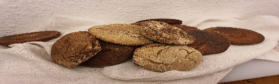

 

- [ ] 150 g [ruisjuurta](sourdough.md) (aktiivista)
- [ ] 5 dl (500g) vettä  
- [ ] 3 rkl (30g) leipäsiirappia tai tummaa siirappia
- [ ] 2 dl  (150g) kaljamaltaita  
- [ ] 8 dl (400g) ruisjauhoja  
- [ ] 4 dl (250g) vehnäjauhoja (täysjyvä)
- [ ] 3 tl (17g) suolaa

1. Ota hapanjuuri jääkaapista noin vuorokautta ennen ja ruoki se. Jos juuri on kovin lämpimässä paikassa, saatat joutua lisäämään vettä ja ruisjauhoja muutamaan kertaan  
2. Ruoki hapanjuuri viimeisen kerran noin 6h ennen käyttöä  
3. Ota juurta talteen (ja siirrä se takaisin jääkaappiin)  
4. Sekoita kaikki raaka-aineet kulhossa sekaisin. Taikina on hyvin tarttuvaa.  
5. Peitä kelmulla ja anna nousta viileässä yön yli.  
6. Kaada taikina seuraavaksi runsaasti jauhotetulle pöydälle. Muotoile taikinasta tanko ja leikkaa se 18 yhtä suureen palaan. Nosta taikinakiekot leivinpaperille, taputtele niitä ohuemmiksi ja anna kohota liinan alla 2-3 tuntia.   
7. Lämmitä uuni 225 asteeseen. Voitele leivät vedellä ja pistele kohonneet leivät haarukalla ennen uuniin laittoa. Paista 30 minuuttia uunin keskitasolla..   
8. Kääri leivät leivinliinaan "jälkipaistumaan" pöydälle