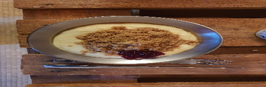

Perunamuusi:  
- [ ] 500g perunaa  
- [ ] 3dl maitoa  
- [ ] 1 sipuli  
- [ ] 2 rkl voita  
- [ ] ½ tl suolaa

Soijarouhe:  
- [ ] 1 dl kasvislientä  
- [ ] 1 rkl soijakastiketta  
- [ ] 2 dl soijarouhetta  
- [ ] 1 dl olutta  

Käristys:  
- [ ] 1 sipuli  
- [ ] 2 rkl voita  
- [ ] 2 ½  dl olutta  
- [ ] 2ml timjamia  
- [ ] 1/2 rkl soijakastiketta  
- [ ] 10 kokonaista mustapippuria

Lisuke:
- [ ] puolukkahilloa

1. Liota soijarouhetta kasvisliemessä, soijakastikkeessa ja oluessa noin kaksi tuntia
2. Valmista perunamuussi keittämällä perunat. Keittämisen jälkeen murskaa perunat haarukalla ja seikoita joukkoon lämmitetty sipulimaito ja voi. 
3. Ruskista sipuli voissa pannulla.
4. Lisää soijarouhe, mustapippurit ja soijakastike ja paista hetki
5. Lisää olut ja anna hautua noin 20 minuuttia 
6. Tarjoile lämmin muussi ja käristys puolukkahillon kera