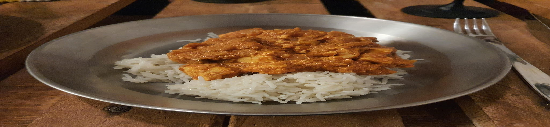

JUUSTO:  
- [ ] 4 dl maitojauhetta  
- [ ] 8 dl vettä  
- [ ] 2 rkl sitruunamehua

RIISI:  
- [ ] 2dl riisiä  
- [ ] 4 dl vettä  
- [ ] Nokare voita tai oliiviöljyä

KASTIKE:  
- [ ] 1 sipuli  
- [ ] 2.5 cm tuoretta inkivääriä  
- [ ] 3 rkl kookosöljyä  
- [ ] 4dl kookosmaitoa  
- [ ] 1 dl tomaattipyrettä  
- [ ] 1 tl korianteria  
- [ ] 1 tl kardemummaa  
- [ ] 1 tl chilijauhetta  
- [ ] 1 tl garam masalaa  
- [ ] ½ tl suolaa  
- [ ] 1 ½ dl cashew-pähkinöitä  
- [ ] 1 dl manteleita

JUUSTO:
1. Sekoita maitojauhe kylmän veteen ja kuumenna kiehuvaksi. Sekoita maitoa pohjaan palamisen välttämiseksi  
2. Lisää sitruunamehu ja sekoita kunnes juusto erottuu herasta.  
3. Siivilöi hera pois juustokankaan avulla.  
4. Laita juusto juustoprässiin noin kahdeksi tunniksi.  

KASTIKE:  
1. Paista pannulla öljyssä pilkotut sipulit, inkivääri, chilit kunnes sipulit ovat läpikuultavia.  
2. Lisää mausteet ja paista noin 30 sekuntia  
3. Lisää tomaattipyre ja vähän vettä ja kiehuta kastiketta joitain minuutteja.  
4. Lisää kookosmaito ja anna kastikkeen kiehua viiden minuutin verran.  
5. Tässä vaiheessa kastikkeen voi antaa jäähtyä ja sekoittaa tehosekoittimella tasaiseksi seokseksi.  
6. Tee 1dl cashew pähkinöistä ja 1 dlmanteleista tahna. Lisää tarvittaessa vettä.  
7. Lämmitä kastike ja lisää pähkinätahna, kuutioitu juusto ja lisää loput cashew pähkinöistä  
8. Tarjoile riisin kera  
  
RIISI:  
1. Mittaa vesi kattilaan ja kuumenna vesi kiehuvaksi.   
2. Lisää voinokare veteen.  
3. Lisää riisi kiehuvaan veteen ja vähennä levyn lämpötila pienelle. Laita kattilankansi päälle ja anna riisin poreilla hiljakseen kattilassa häiritsemättä paketin ohjeiden mukaan.  
4. Kun vesi on imeytynyt riisiin kokonaan on riisi valmista. Sekoita valmiiseen riisiin ilmavuutta ennen tarjoilua.