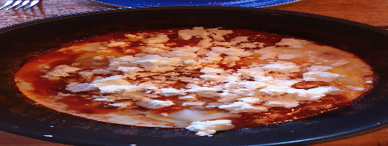

 

- [ ] 2 rkl oliiviöljyä  
- [ ] 4 kynttä valkosipulia  
- [ ] 1 sipuli  
- [ ] 400g kokonaisia tölkkitomaatteja  
- [ ] ½ rkl savustettua paprikajauhetta  
- [ ] 1 tl kuminaa  
- [ ] ½ tl kuivattua oreganoa  
- [ ] ⅛ tl chilihiutalieta  
- [ ] ½ tl suolaa  
- [ ] 2 kananmunaa  
- [ ] 180g fetaa

1. Murskaa valkosipuli ja pilko sipuli hienoksi  
2. Paista molemmat keskilämmöllä oliiviöljyssä kunnes sipulit ovat pehmenneet (noin 5 minuuttia)  
3. Lisää tölkkitomaatit pannulla. Pilko tomaateista paloja puulastalla.   
4. Lisää savustettu paprika, kumina, oregano ja chilihiutaleet. Sekkoita.  
5. Anna kastikkeen hautua välillä sekoittaen (noint 7 minuuttia) tai kunnes kastike hieman tiivistyy  
6. Kaiva lastalla kananmunille pienet kolot ja riko munat kastikkeen joukkoon.  
7. Anna munien paistua noin 5 minuuttia tai kunnes valkuaiset ovat hyytyneet kunnolla.  
8. Tarjoile murskatun fetan kanssa