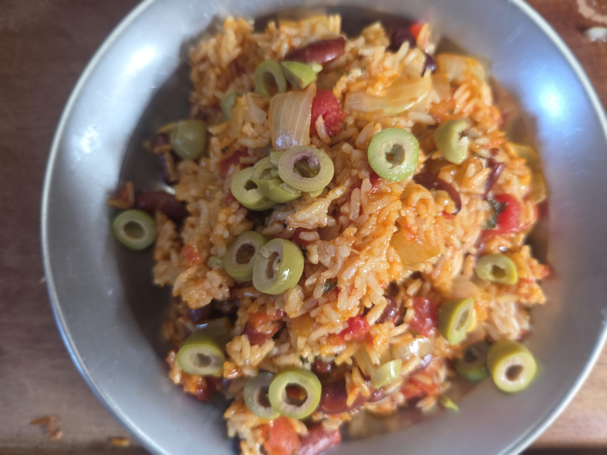

- [ ] 3dl kidney-papuja
- [ ] 1 sipuli
- [ ] 3 kynttä valkosipulia
- [ ] 2.5dl riisiä
- [ ] 400g tomaattimurskaa
- [ ] 4dl kasvislientä 
- [ ] 1tl paprikajauhetta
- [ ] 1tl suolaa
- [ ] 1tl kuivattua oreganoa
- [ ] 0.5tl chilijauhetta
- [ ] oliiviöljyä
- [ ] mustapippuria
- [ ] oliiveja

1. Keitä pavut pehmeiksi (noin 30min painekattilassa) ja laita sivuun
2. Paista sipuli ja valkosipuli öljyssä kunnes sipuli on läpikuultavaa
3. Lisää mausteet ja sekoita
4. Lisää riisi ja paista kunnes riisi on läpikuultavaa
5. Lisää tomaatti
6. Lisää kasvisliemi
7. Keitä 10min paineessa
8. Tarjoile oliivin kera
