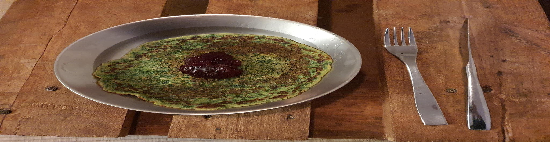

- [ ] 2 dl kuivattua pinaattia  
- [ ] 3 munaa  
- [ ] 1 dl maitojauhetta  
- [ ] 5 dl vettä  
- [ ] 3 dl vehnäjauhoja  
- [ ] ½ dl voita (sulatettuna)
- [ ] ½ tl suolaa
- [ ] puolukkahilloa

1. Riko kananmunien rakenne  
2. Lisää kylmä vesi ja sekoita maitojauhe joukkoon.  
3. Lisää vehnäjahot.  
4. Lisää sulatettu hieman viilentynyt voi.  
5. Lisää suola  
6. Lisää pinaatti ja sekoita  
7. Anna taikinan seistä 30 minuuttia ennen paistamista.  
8. Paista noin lettupannulla voin kanssa. Noin desi taikinaa per lettu.  
9. Tarjoile puolukkahillon kanssa.