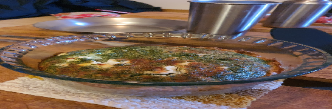

**Taikina**  
- [ ] 3 dl vehnäjauhoja  
- [ ] ½ tl suolaa  
- [ ] 1 dl oliiviöljyä  
- [ ] 1 dl vettä  
**Täyte**  
- [ ] 1 dl kuivaa pinaattia  
- [ ] 1 ½ vettä pinaatin kostutukseen  
- [ ] 100g fetaa  
- [ ] 3 munaa  
- [ ] 1.5 dl maitoa  
- [ ] 1 sipuli pilkottuna  
- [ ] ½ dl raastettua parmesania  
- [ ] ½ tl mustapippuria  
- [ ] ½ tl persiljaa

1. Lämmitä uuni 220 asteeseen  
2. Sekoita öljy ja vesi, lisää jauhot ja suola  
3. Sekoita taikina ja painele vuoan pohjalle ja reunoille  
4. Sekoita kuiva pinaatti veteen ja anna liota noin 5 minuuttia ja valuta ylimääräinen neste pois  
5. Hienonna fetajuusto haarukalla.   
6. Laita feta ja pinaatti vuokaan  
7. Sekoita maito, munat, sipuli, parmesan ja mausteet keskenään ja kaada vuokaan  
8. Paista 220 asteessa uunin keskitasolla noin 45 minuuttia  
9. Quiche on valmis kun täytteeseen painettu veitsi tulee siistinä ulos  
10. Anna jäähtyä