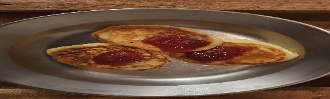

 

- [ ] 250g maustamaton rahka (löysä saksalainen)  
- [ ] 20g sokeria  
- [ ] 1tl vaniljasokeria  
- [ ] 1 muna  
- [ ] 1dl vehnäjauhoja  
- [ ] voita paistamiseen

1. Sekoita kaikki aineet keskenään  
2. Anna taikinan seisoa noin 20 minuuttia  
3. Paista pannulla noin kahdeksan minuuttia.
4. Tarjoile hillon kanssa.