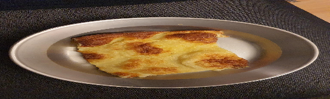

 

Asuntouuniannos  
- [ ] 5dl maitoa  
- [ ] 2kananmunaa  
- [ ] ½ dl sokeria  
- [ ] 1 tl suolaa  
- [ ] 2 ½ dl	vehnäjauhoja  
- [ ] 25 g voi  

TAI

Veneannos: optimoitu omnialle  
- [ ] 2 dl vettä  
- [ ] 2 ½ rkl maitojauhetta  
- [ ] 1 kananmunaa  
- [ ] 2 rkl  sokeria  
- [ ] 3ml  suolaa  
- [ ] 1  dl vehnäjauhoja  
- [ ] 10 g voita

1. Vatkaa ensin kevyesti munat ja sokeri. Lisää suola ja maito ja lopuksi jauhot pienissä erissä.  
2. Lisää taikinan joukkoon sulatettu margariini tai voi. Voit myös laittaa rasvan pieninä nokareina pannukakkutaikinan pinnalle.  
3. Anna taikinan turvota uunin lämpenemisen ajan.   
4. Kaada taikina reunalliselle uunipellille, joka on vuorattu rasvalla voidellulla leivinpaperilla.  
5. Kypsennä 225-asteisen uunin  keskitasolla kauniin väriseksi n. 25 min ajan. **Omniassa**: eka minuutti täydellä lämmöllä, sitten pienelle, noin 225 astetta 35 min