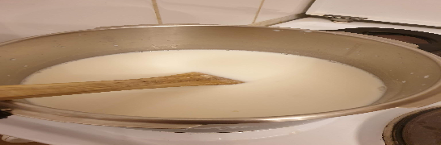

- [ ] 2 dl kuohukermaa tai 2dl vettä ja 0.5dl maitojauhetta  
- [ ] 1 ½ dl sokeria  
- [ ] ½ dl siirappia  
- [ ] 25 g voita

1. Sekoita ainekset paksupohjaisessa kattilassa. Levy keskilämmöllä. Anna seoksen kiehua poreillen 30 min. Sekoita välillä, varsinkin keittoajan lopussa, ettei seos tartu pohjaan.  
2. Kun toffee alkaa saostua, tipauta seosta kylmään veteen n. ½ tl. Anna jäähtyä hetken. Mikäli seos jähmettyy vedessä niin, että voit muotoilla sen palloksi, on toffeeseos valmista.  
3. Kaada seos leivinpaperille. Anna kovettua. Leikkaa paloiksi. Toffee leikkautuu parhaiten, kun se on täysin jäähtynyttä.  
 
 LAKRITSATOFFEET  
Lisää keitettyyn seokseen 75g aivan pieneksi kuutioiksi leikattua lakritsaa. Kaada seos kovettumaan.
