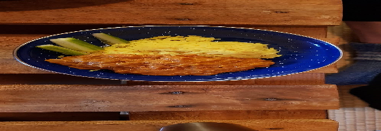

TOFU:  
- [ ] 1 rkl maissitärkkelystä  
- [ ] ½ tl  garam masalaa  
- [ ] 3ml inkiväärijauhetta   
- [ ] 2ml chilijauhetta
- [ ] 3ml curryjauhetta  
- [ ] 3 rkl kookosöljyä
- [ ] 200 g kiinteää tofua
- [ ] 2dl riisiä  
- [ ] 4 dl vettä  
- [ ] Nokare voita tai oliiviöljyä

KASTIKE:  
- [ ] 1 ½ rkl kookosöljyä  
- [ ] 400ml kookosmaitoa  
- [ ] 1 rkl garam masalaa  
- [ ] 1 tl inkiväärijauhetta  
- [ ] ½ tl chilijauhetta (mieto)  
- [ ] ½ tl mustapippuria  
- [ ] 1 tl curryjauhetta  
- [ ] 1 sipuli  
- [ ] 1 porkkanaa 
- [ ] 1 tl suolaa  
- [ ] 70 g tomaattipyrettä  
- [ ] Sitruunamehua

TOFU:
1. Prässää tofu.  
2. Pilko tofu kuutioiksi.  
3. Sekoita maissitärkkelys ja mausteet.  
4. Sekoita mausteet ja kuutioitu tofu kunnes kaikissa tofuissa on maustekerros. Anna tofujen maustua vähintään 15 minuuttia.  
5. Lisää kookosöljy keskilämpimälle pannulle. Kun kookosöljy on lämmennyt lisää kuutioitu maustunut tofu ja paista kunnes tofut ovat kaikilta sivuilstaan kauniin kullanruskeita. Siirrä tofu sivuun odottamaan muun kastikkeen valmistumista

KASTIKE:
6. Käyttäen samaa pannua paista keskilämmöllä kookosöljyssä sipuli ja porkkanat kunnes ne pehmenevät.  
7. Lisää sekoitetut mausteet ja paista sipulin kanssa noin 30 sekuntia  
8. Lisää kookosmaito ja tomaattipyrä ja sekoita kaikki tasaiseksi seokseksi  
9. Keitä kastiketta kokoon noin viiden minuutin ajan  
10. Lisää tofu ja sekoita  
11. Vähennä lämpötilaa ja anna kastikkeen hautua 5-10 minuuttia, jotta tofu maustuu ja makuuntuu kunnolla. Lopuksi lisää yhden limen mehu ja lisää kastikkeeseen suolaa tarvittaessa  

RIISI:  
6. Mittaa vesi kattilaan ja kuumenna vesi kiehuvaksi.   
7. Lisää voinokare veteen.  
8. Lisää riisi kiehuvaan veteen ja vähennä levyn lämpötila pienelle. Laita kattilankansi päälle ja anna riisin poreilla hiljakseen kattilassa häiritsemättä paketin ohjeiden mukaan.  
9. Kun vesi on imeytynyt riisiin kokonaan on riisi valmista. Sekoita valmiiseen riisiin ilmavuutta ennen tarjoilua.