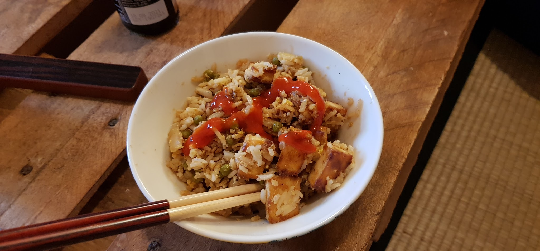

 

tofu:  
- [ ] 200g kiinteää tofua  
- [ ] 1 rkl maissitärkkelystä  
- [ ] ¼ tl chili jauhetta  
- [ ] ½ tl savupaprikajauhetta  
- [ ] ¼ tl mustapippuri  
- [ ] 1 tl soijakastiketta  
- [ ] ½ tl sriracha kastiketta  
- [ ] 2 tl rypsiöljy

kastike:  
- [ ] 2 sipulia  
- [ ] 2 kynttä valkosipulia  
- [ ] 2.3 dl riisiä  
- [ ] 2-3 munaa  
- [ ] 1 rkl soijakastiketta  
- [ ] 1 rkl sriracha kastiketta  
- [ ] 2 rkl rypsiöljy  
- [ ] 1 cm pala inkivääriä

1. Keitä riisi, pyöhi ja jätä jäähtymään  
2. Jos et käytä kiinteää tofua, prässää se kiinteäksi  
3. Sekoita tofun mausteet kulhossa tahnaksi  
4. Listää tofu kulhoon ja sekoita. Anna maustua vähintään 15 minuuttia  
5. Paista tofu pannulla rypsiöljyssä kunnes tofut ovat kauniin ruskeita ja laita tofut kulhoon odottamaan  
6. Pilko sipulit pieneksi  
7. Paista sipulit ja valkosipuli pannulla, kunnes ne ovat hieman läpikuultavia  
8. Lisää keitetty riisi ja paista vielä hetki  
9. Riko munien rakenne ja lisää pannulle. Paista kunnes munat ovat keltaisia  
10. Lisää tofu ja paista vielä hetki  
11. Raasta inkivääri ja lisää pannulle  
12. Lisää soijakastike ja sriracha kastiketta maun mukaan