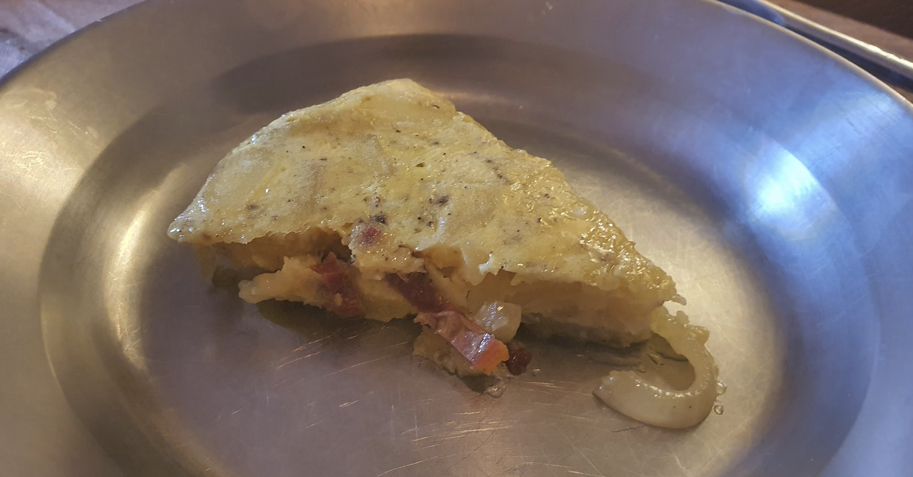

- [ ] 450g (n. 8 kpl) perunoita (kuorittuja)
- [ ] 0.6 dl oliiviöljyä  
- [ ] 1 sipuli  
- [ ] 4 munaa  
- [ ] Suolaa  
- [ ] Mustapippuria  
- [ ] 1dl aurinkokuivattuja tomaatteja  
- [ ] Persiljaa

1. Lämmitä oliiviöljy pannulla keskilämmöllä  
2. Leikkaa perunat 0.5cm paksuisiksi viipaleiksi ja lisää pannulle. Keitä noin 20min, nostaen valmiit viipaleet pois  
3. Ota perunat jäähtymään ja lisää niihin suolaa ja pippuria  
4. Tee sipulista rinkuloita ja ruskista pannulla. Nosta jäähtymään  
5. Vispilöi munat kulhossa tasaiseksi  
6. Sekoita perunat, sipuli, ja tomaatti munaan  
7. Kaada sekoitus pannulle ja paista noin 10min miedolla lämmöllä kunnes pohja on ruskea  
8. Käännä tortilla lautasen avulla ja paista vielä noin 4min  
9. Ota tortilla jäähtymään ja tarjoile huoneenlämmössä persiljan kera